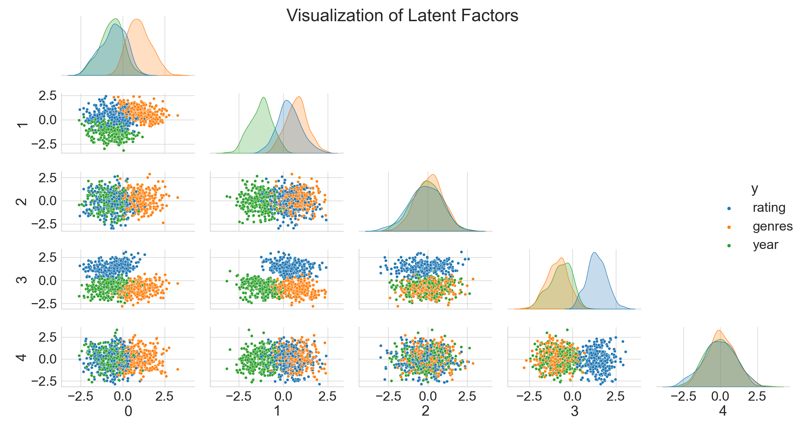
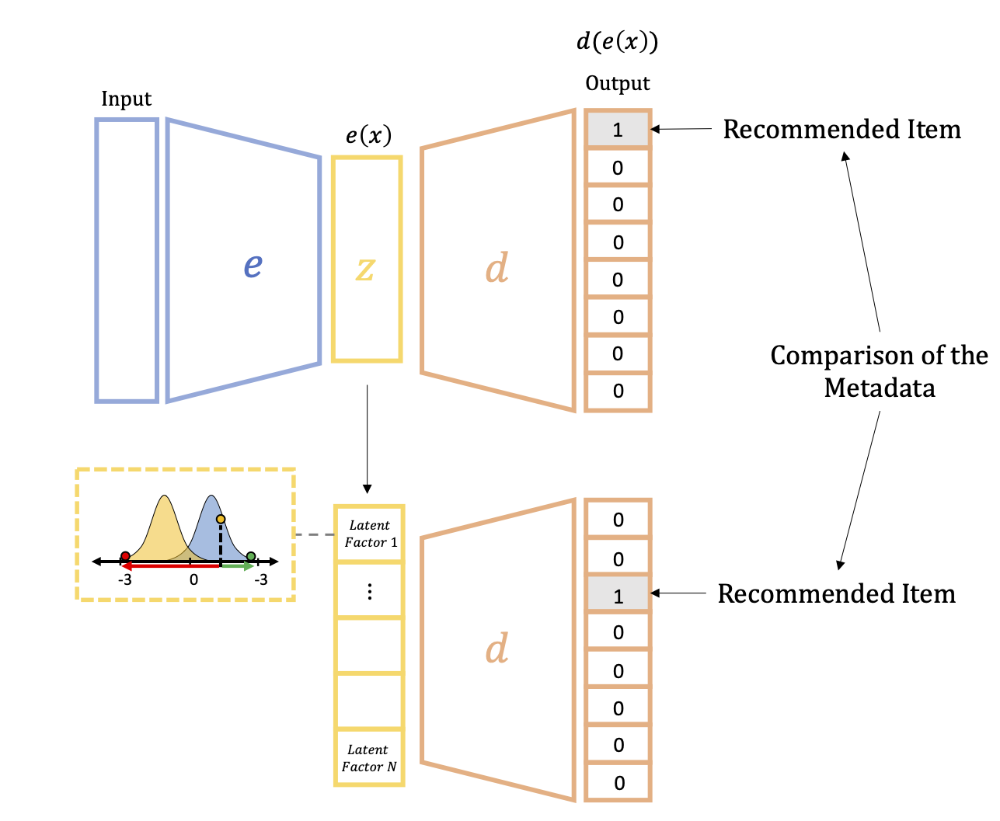
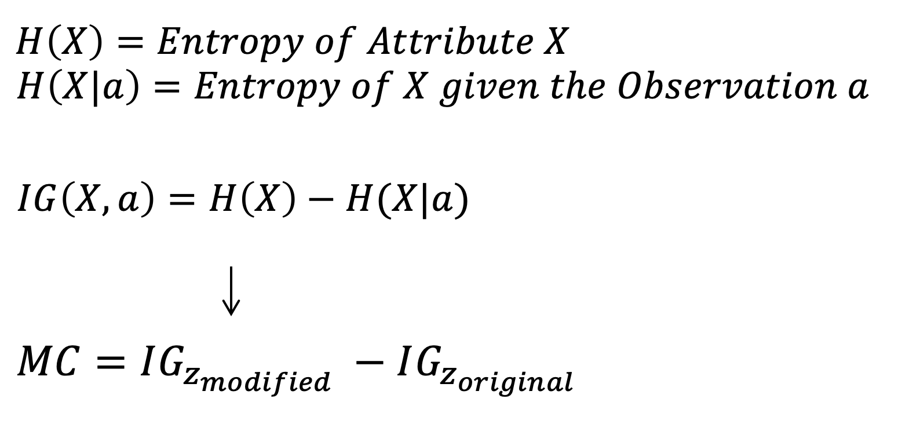
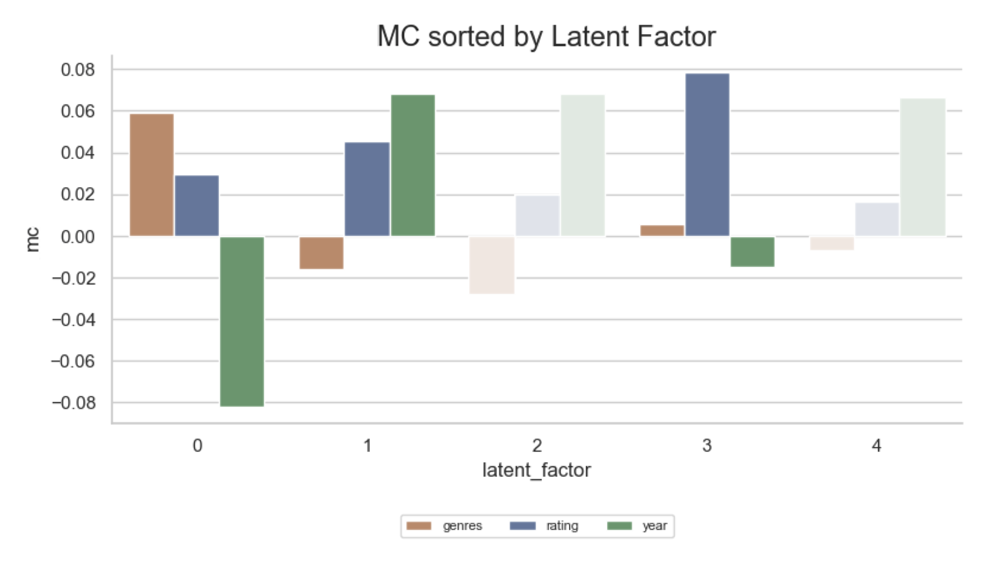

<h1 align="center">
     </a>
     
</h1>

    <strong>Decoding Latent Factors</strong>

This repository describes the analysis of the latent space Z generated by Variational Autoencoders (VAE) to provide an interpretation of it which could serve as an explanation to the user in a downstream task.

## Keywords
- 🎥 Recommender Systems
- 👥 Collaborative Filtering
- ☝🏽 Model-Specific Explanatory Method
- 🚀 VAEs and AEs
- 🔎 Latent Space Analysis
  
## Architecture
- Python 3.7
- PyTorch Lightning
- WandB (Weights and Biases)
- IDE: PyCharm (no jupyter notebooks are available)

 We use PyTorch Lightning to provide a pluggable mechanism to connect to various online logging tools and to reduce the boilerplate of the network creation. We offer the possibility to intercept the latent space creation Z of a VAE or AE to apply decoding algorithms and latent space calculations.  

## Approaches
We introduce a new approach to decode the latent space. We compare the condition of the latent space caused by different hyperparameters with the latent space of an Autoencoder that serves as a baseline. Our initial goal was to explain which attributes a VAE encodes for the MovieLens dataset. We made the experience that training and studying VAEs on the MovieLens dataset without knowing the generative factors is very difficult. To reduce the complexity of our research, we created a synthetic dataset generated by three generative factors (D), namely 'genre', 'year', and 'rating'. This helped tremendously to gain knowledge about the latent space Z.

We present two approaches based on the idea that, given enough metadata, we can quantify the change in attributes using techniques from information theory. 

<h1 align="center">
     </a>
     
</h1>

The first approach is based on the idea of Higgins et al. in <i>Early Visual Concept Learning with Unsupervised Deep Learning</i>, where the latent vector z is modified, and the changes in the results are observed. The Magnitude of Change (MC) is quantified by the relative difference of the Information Gain (IG) from the result of the modified latent vector z' to the original result. 

The Magnitude of Change MC is specified as the relative Information Gain of a modified latent vector z'. The equation is outlined below.

<!---->
<h1 align="center">
     </a>
     
</h1>

The second approach aims at sampling the negative and positive spectrum for each latent dimension z_i while keeping the remaining latent factors at 0. If the latent values are kept at 0, they are ignored by the decoder d(z). For the second approach, we also calculate the Information Gain on the results X', but without contrasting them as we do in the first approach.

## Results
<h1 align="center">
     </a>
     
</h1>

We could establish that both approaches can decode latent factors, with the concept that computes the relative Information Gain being able to explain the encoding of the latent space Z entirely. The concept that computes the absolute IG of the sampled latent vector z is able to map two out of three generative factors D to latent factors. The difference between the two solutions, besides their approach, is that the sampling procedure determines whether the latent factor z_i encodes the generative factor in the positive or negative spectrum of its dimension. This further simplifies the sampling procedure in a productive Recommender System since it is known from which spectrum the sampling must be taken. 

## Goals
If the conditions of disentanglement and continuity are given, and the latent factors z are successfully decoded, two main advantages can be mentioned. First, Recommender Systems with a decoded latent space Z can explain to a user why a particular recommendation was made. This is also important from a legal perspective. In addition, the system could be designed to allow the user to customize the computed latent factors z to their needs. Second, this would be an enormous help with the cold start problem. A user could select a latent factor z_i of interest, and VAEs can sample from its distribution, offering a user new recommendations. This would not be possible with an Autoencoder. Based on our experiments, we deduce that the entanglement of Autoencoders is too strong, and the latent space Z is not regularized.

## Future Work
This work lays the foundation for further research on decoding the latent space Z of Latent Factor Models in the area of Recommender Systems with Collaborative Filtering. Our two proposed methods do not apply exclusively to VAEs but can be applied to any Latent Factor Model that generates a latent space Z. One major drawback we have experienced is that VAEs are fragile. Hence, further research could improve the robustness of the algorithm. The second open question we noticed is that the complexity of the dataset significantly affects the needed training time of VAEs to regularize the latent space Z. This could be addressed by developing an approach to measure the complexity of a dataset. As a next step in the future, we would propose to conduct research on our initial dataset, MovieLens, which reflects the interactions of real users.